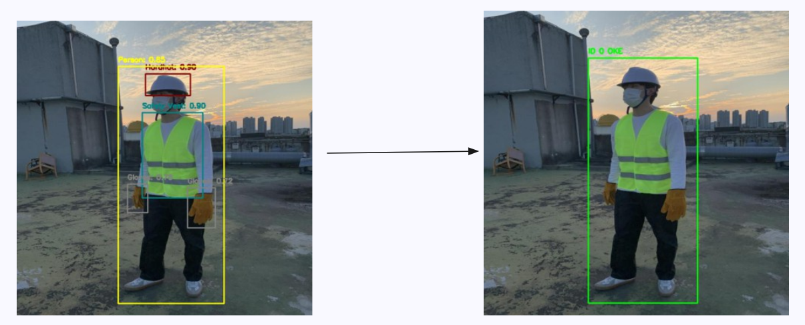

# CS406 PPE Violation Detection
- Professor: ThS. Cáp Phạm Đình Thăng (thangcpd@uit.edu.vn)
- Course Id: CS406.P11 (Xử lý ảnh và ứng dụng)

## Team Members
| Name                | MSSV      | Roles  |
|---------------------|-----------|--------|
| Nguyễn Hữu Nam      | 22520917  | Leader |
| Nguyễn Trần Phúc    | 22521135  | Member |
| Hồ Trọng Duy Quang  | 22521200  | Member |

## A glimpse of the project
<div align="center">
  
  <p><em>Figure 1: Overview of how Violation Detection works on image</em></p>
</div>

<div align="center">
  
  <p><em>Figure 2: Overview of how Violation Detection works on video</em></p>
</div>

<div align="center">
  
  <p><em>Figure 3: Project pipeline</em></p>
</div>

<div align="center">
  
  <p><em>Figure 4: Web demo</em></p>
</div>

> **Overview**: this project focus on detecting PPE (Hardhat, Helmet, Gloves) and classify each person if they are missing one of these
- *Image*: detect + classify violation
- *Video*: detect + track + classify violation (video result: [drive](https://drive.google.com/drive/folders/15crPWioDnb8FuSfXhSJFO__1lEhy6D6j?usp=sharing))
# Project structure
```python
CS406-PPE-detection/
├── data/
│   ├── data-ppe.yaml
│   └── split/      #contain train, val, test
├── logs/
├── notebooks/
├── output/
├── sample/
├── scripts/
│   ├── detect_faster_rcnn.py
│   ├── detect_yolo.py
│   ├── loader_faster_rcnn.py
│   └── tracker_yolo.py
├── src/
│   ├── loader/
│   ├── models/
│   ├── parsers/
│   ├── trackers/
│   └── utils/
├── tools/
├── web/
│   ├── app.py
│   └── output/     #output of web
├── weights/
│   ├── best_faster_rcnn.pt
│   └── best_yolo.pt
├── README.md
├── requirements.txt
└── setup.py
```
# I. How to build
## 1. Installing 
```
git clone https://github.com/Beeditor04/CS406-PPE-detection.git
cd CS406-PPE-detection
pip install -r requirements.txt
python setup.py develop
```
## 2. Preparing model
you can download our pretrain `faster-rcnn` and `yolov5n` model here:
- `faster-rcnn`: [drive](https://drive.google.com/file/d/1ciFtmC6eh0wRoK3yU4rS1JlmdH_ee01i/view?usp=drive_link)
- `yolov5n`: [drive](https://drive.google.com/file/d/1VuorH4fgbafaroALJNafHeSMQdweAHsz/view?usp=drive_link)

And then put it in folder `weights`.

## 3. Dataset 
- SH17 dataset: [kaggle](https://www.kaggle.com/datasets/mugheesahmad/sh17-dataset-for-ppe-detection)
- Our dataset (put it in `data/`): [kaggle](https://kaggle.com/datasets/cc917aa906937756371b0386a45fd9c3ed1c8d2d3412fc3e6d5f97c724725e94)
- `data-ppe.yaml`: [drive](https://drive.google.com/file/d/1P9rRNMd3ErvO47f3xOn6nnsla0waxRC7/view?usp=drive_link) 

# II. Deploy web
```
streamlit run web/app.py
```

# III. Model
- remember to create `.yaml` file, put it in the folder `data/` or wherever you want
## train Faster RCNN
```
python scripts/train_faster_rcnn.py --data_dir "data/split" --batch_size 8 --epochs 10 --eval_every 5 --iter_every 5 --num_classes 7 --yaml "data/data-ppe.yaml" --lr 0.005 --resize 640 --is_aug 0
```
## train YOLOv5n
- (it've done in jupyter notebook, in `notebooks/train_yolo`)

## run 1 image Faster RCNN inference
```
python scripts/detect_faster_rcnn.py --weights weights/best_faster_rcnn.pt --img_path sample/images/1.jpg
```

## run 1 image YOLO inference
```
python scripts/detect_yolo.py --det_weights weights/best_yolo_10_70epochs.onnx --enable_pose --pose_backend rtmpose --pose_weights weights/rtmpose-t-17.onnx --img_path sample/images/17.jpg --yaml_class data/data-ppe_v4-kaggle.yaml --profile
```

## run tracker YOLOv5n on video
```
python scripts/yolo/tracker_yolo.py \
  --weights weights/best_yolo_10_70epochs.pt \
  --pose_backend rtmpose \
  --pose_weights weights/rtmpose-t-17.onnx \
  --enable_pose \
  --vid_dir sample/videos/3.mp4 \
  --yaml_class data/data-ppe_v4-kaggle.yaml \
  --violate_stride 2 \
```
##  run tracker Faster RCNN on video
```
python scripts/tracker_faster_rcnn.py --weights weights/best_faster_rcnn.pt --vid_dir sample/videos/1.mp4
```
---
# IV. Dataset tools (`tools/`)
- split dataset
```
python scripts/split_dataset.py --data_dir data/ --output_dir data/split/ --train_size 0.7 --test_size 0.1
```
- split dataset 10% for exps
```
python scripts/split_dataset_01.py --data_dir data/ --output_dir data/split_01/ --train_size 0.7 --test_size 0.1
```
- count dataset
```
python scripts/count.py --main data/split
```

- valid dataset
```
python scripts/is_valid_dataset.py
```


