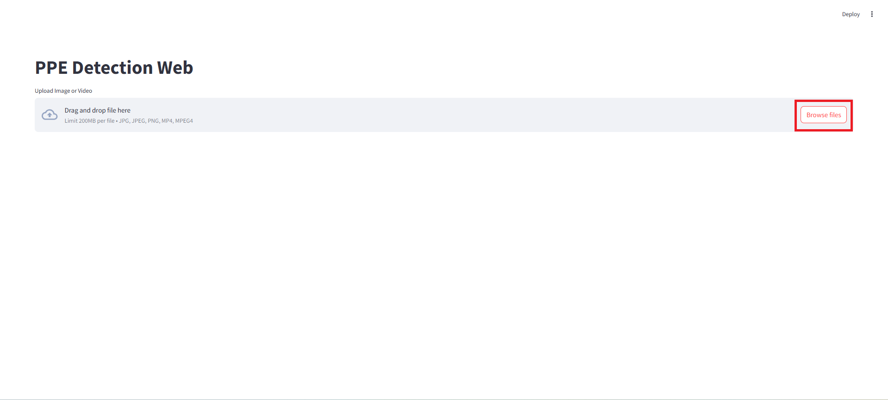
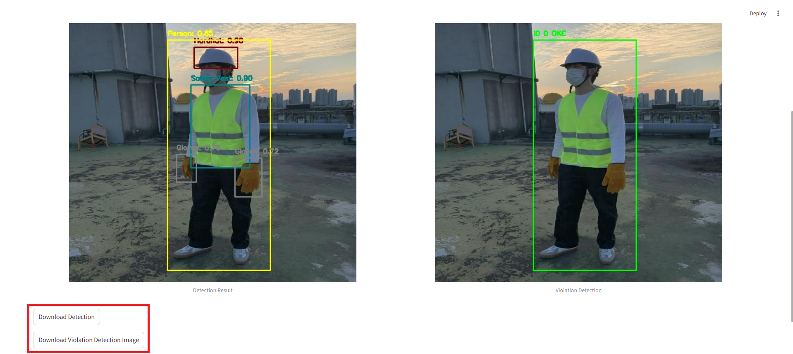

## How to deploy web on streamlit:
* git clone our github repository
```
git clone https://github.com/Beeditor04/CS406-PPE-detection.git
```
* install dependencies
```
pip install -r requirements.txt
```
* deploy web on streamlit
```
streamlit run web/app.py
```

## Web funtion:
* Click `Browse files` to upload an image or a video you want to detect

* After the image/video is detected, result will be displayed below. Click `Download` to download the result
